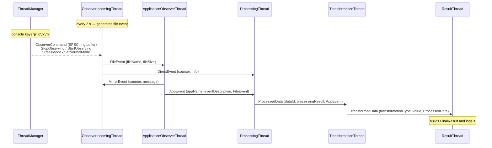
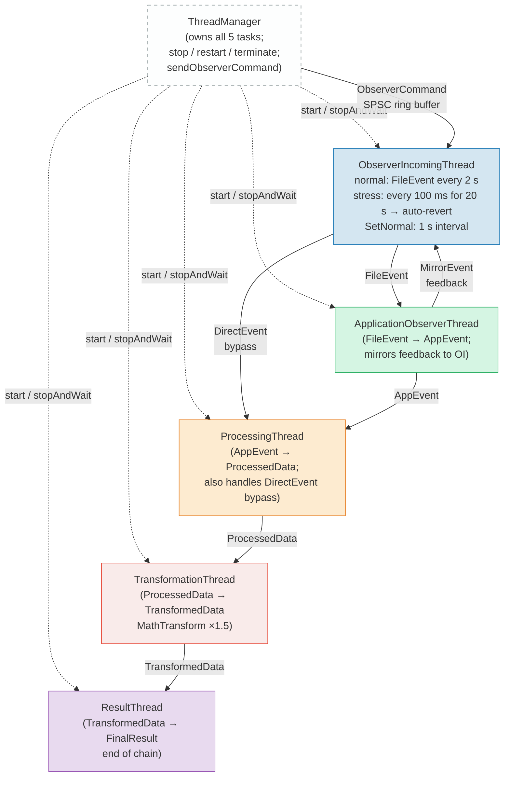

# Thread-Safe Messaging Library

A C++20 boilerplate for type-safe inter-thread message passing built around a 5-thread processing chain prototype.

---

## Architecture Overview

The library is structured in two layers:

| Layer | Location | Purpose |
|---|---|---|
| **Messaging / Threading** | `src/include/messaging/`, `src/include/threading/` | Reusable primitives |
| **Application** | `src/include/`, `src/src/` | Demo chain and daemon harness |

### Core Primitives

| Component | File | Description |
|---|---|---|
| `MessageBase` / `MessageWrapper<T>` | `messaging/messageBase.hpp` | Virtual base + type-erasing wrapper for any payload |
| `MessageQueue` | `messaging/messageQueue.hpp` | Mutex + condition-variable queue; blocking `wait()`, timed `wait_for()`, non-blocking `try_pop()` |
| `Sender` | `messaging/messageSender.hpp` | Non-owning handle; `Send<T>(args...)` constructs and enqueues a `MessageWrapper<T>` |
| `Receiver` | `messaging/messageReceiver.hpp` | Base class; override `onPostMessageReceived()` as a post-push callback |
| `workerBase` | `workerBase.hpp` | Manages one `compat::JThread`; cooperative cancellation via stop tokens |
| `SpScRingBuffer<T>` | `threading/spScRingBuffer.hpp` | Lock-free SPSC ring buffer (power-of-two capacity); timed `wait_pop_for()` |
| `ThreadSafeQueue<T>` | `threading/threadSafeQueue.hpp` | Mutex-protected queue with `waitPop()` / `tryPop()` |

### TaskBase and Task

`messaging::TaskBase` combines `Receiver + Sender + workerBase` into a single base for all worker threads. Subclasses implement:
- `run(std::stop_token)` — main execution loop
- `onPostMessageReceived()` — called immediately after a message is enqueued (used to wake the thread)
- `isReadyToStart()` — precondition check before the thread launches

`messaging::Task` is a concrete `TaskBase` that accepts a lambda as its run function, useful for ad-hoc threads without a dedicated subclass.

---

## 5-Thread Messaging Chain

### Data Types (`src/include/dataTypes.hpp`)

| Struct | Fields | Produced by |
|---|---|---|
| `FileEvent` | `fileName`, `fileSize` | `ObserverIncomingThread` |
| `DirectEvent` | `counter`, `info` | `ObserverIncomingThread` (bypass path) |
| `MirrorEvent` | `counter`, `message` | `ApplicationObserverThread` (feedback) |
| `AppEvent` | `appName`, `eventDescription`, `originalFile` | `ApplicationObserverThread` |
| `ProcessedData` | `dataId`, `processingResult`, `originalAppEvent` | `ProcessingThread` |
| `TransformedData` | `transformationType`, `value`, `originalData` | `TransformationThread` |
| `FinalResult` | `success`, `summary`, `originalTransformedData` | `ResultThread` |
| `ObserverCommand` | `type` (`StopObserving`/`StartObserving`/`StressMode`/`SetNormalMode`), `durationSec` | `ThreadManager` → SPSC ring buffer |

### Thread Classes (`src/include/testThreads.hpp`)

| Thread | Receives | Sends | Notes |
|---|---|---|---|
| `ObserverIncomingThread` | `MirrorEvent` (feedback), `ObserverCommand` (SPSC ring buffer) | `FileEvent` → AO, `DirectEvent` → PT | Normal: 2 s interval; stress: 100 ms for 20 s then auto-revert to 2 s; `SetNormalMode` → 1 s |
| `ApplicationObserverThread` | `FileEvent` | `MirrorEvent` → OI, `AppEvent` → PT | Mirrors each event back to observer |
| `ProcessingThread` | `AppEvent`, `DirectEvent` | `ProcessedData` → TT | Handles both main path and bypass |
| `TransformationThread` | `ProcessedData` | `TransformedData` → RT | Applies `MathTransform` (×1.5) |
| `ResultThread` | `TransformedData` | — | Logs `FinalResult`; end of chain |

#### ObserverIncomingThread modes

| Mode | Event interval | Activated by | Exit condition |
|---|---|---|---|
| **Normal** | 2 000 ms | Initial state / after stress auto-revert | — |
| **Stress** | 100 ms | `StressMode` command (`x` key) | Auto-reverts to Normal after 20 s |
| **SetNormal** | 1 000 ms | `SetNormalMode` command (`n` key) | Manual; stays at 1 s until next mode change |

### ThreadManager (`src/include/threadManager.hpp`)

Owns all five `TaskBase` tasks, wires the sender/receiver links, and exposes lifecycle operations:

| Method | Description |
|---|---|
| `initTestChain()` | Creates and links all 5 threads, then starts them |
| `addTask(shared_ptr<TaskBase>)` | Start and register an existing task |
| `addTask(RunFunction)` | Create a lambda-based `Task`, start, and register it |
| `sendObserverCommand(cmd)` | Push a raw `ObserverCommand` into the observer's SPSC ring buffer |
| `sendStressModeCommand()` | Convenience: activate stress mode (100 ms / 20 s auto-revert) |
| `sendNormalModeCommand()` | Convenience: exit stress immediately, set 1 s interval |
| `stopAllThreads()` | Stop all tasks (keep registered) |
| `restartAllThreads()` | Restart any stopped tasks |
| `terminateAllThreads()` | Stop all tasks and clear the list |
| `stopLastThread()` | Stop and remove the most recently added task |
| `getThreadCount()` | Return the number of registered tasks |

### Console Commands (`src/src/main.cpp`)

When running in foreground mode (`-F` / no `-D`), stdin accepts single-key commands:

| Key | Action |
|---|---|
| `h` / `?` | Show this help |
| `q` | Quit the application |
| `s` | Stop all threads |
| `r` | Restart all threads |
| `t` | Terminate (stop + clear) all threads |
| `p` | Pause observing for 15 s (`StopObserving`) |
| `o` | Resume observing in 5 s (`StartObserving`) |
| `x` | Activate stress mode: 100 ms interval for 20 s, then auto-revert to 2 s normal |
| `n` | Set normal mode: exit stress immediately, switch to 1 s interval |
| `v` | Print version |

---

## Message Flow Diagrams

### Sequence Diagram



### Thread Topology



### Message Types per Edge

| Source | Destination | Message type | Trigger |
|---|---|---|---|
| `ThreadManager` | `ObserverIncomingThread` | `ObserverCommand::StopObserving` (SPSC) | Console key `p` |
| `ThreadManager` | `ObserverIncomingThread` | `ObserverCommand::StartObserving` (SPSC) | Console key `o` |
| `ThreadManager` | `ObserverIncomingThread` | `ObserverCommand::StressMode` (SPSC) | Console key `x` |
| `ThreadManager` | `ObserverIncomingThread` | `ObserverCommand::SetNormalMode` (SPSC) | Console key `n` |
| `ObserverIncomingThread` | `ApplicationObserverThread` | `FileEvent` | Every 2 s (when not paused) |
| `ObserverIncomingThread` | `ProcessingThread` | `DirectEvent` | Every 2 s — bypass path |
| `ApplicationObserverThread` | `ObserverIncomingThread` | `MirrorEvent` | On each `FileEvent` received |
| `ApplicationObserverThread` | `ProcessingThread` | `AppEvent` | On each `FileEvent` received |
| `ProcessingThread` | `TransformationThread` | `ProcessedData` | On each `AppEvent` received |
| `TransformationThread` | `ResultThread` | `TransformedData` | On each `ProcessedData` received |

Notable non-linear paths:
- **Direct bypass**: `ObserverIncomingThread → ProcessingThread` via `DirectEvent` (skips `ApplicationObserverThread`)
- **Mirror feedback loop**: `ApplicationObserverThread → ObserverIncomingThread` via `MirrorEvent`
- **Out-of-band control**: `ThreadManager → ObserverIncomingThread` via SPSC `ObserverCommand` ring buffer (separate from the `MessageQueue` path)

---

## Build & Run

```bash
# Configure (Debug)
cmake -B build -S .

# Configure (Release)
cmake -B build -S . -DCMAKE_BUILD_TYPE=Release

# Build
cmake --build build -- -j$(nproc)

# Run in foreground
./build/bin/threadMsg

# Run as daemon
./build/bin/threadMsg -D

# Run tests
cd build && ctest

# Generate Doxygen docs
cmake --build build --target doc
```

Build output: `build/bin/` (executables), `build/lib/` (libraries).