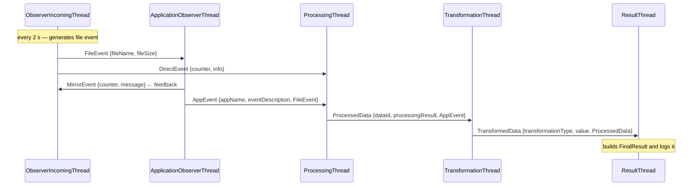
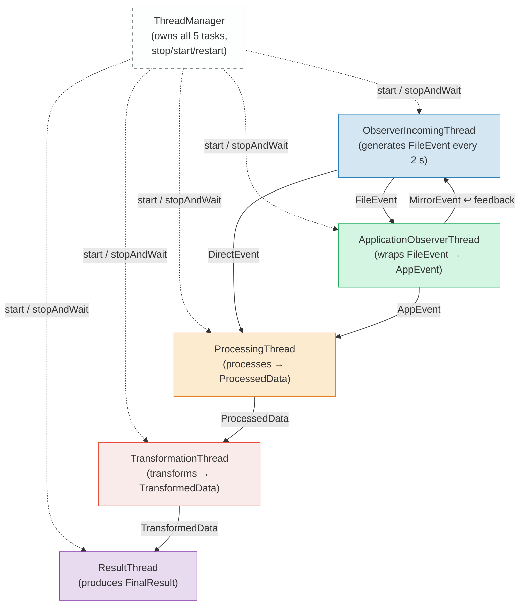

Thread-Safe Messaging library
=============================

## Developer Note: 5-Thread Messaging Prototype

### Overview
This extension demonstrates a message-passing chain between 5 worker threads using the existing C++ messaging infrastructure.

### Extended Components
- **`src/include/dataTypes.hpp`**: Added new struct types (`FileEvent`, `AppEvent`, `ProcessedData`, `TransformedData`, `FinalResult`) to represent different stages of the processing chain.
- **`src/include/testThreads.hpp`**: Implemented 5 new worker classes inheriting from `messaging::TaskBase`:
    1. `ObserverIncomingThread`: Simulates file events and starts the chain.
    2. `ApplicationObserverThread`: Receives `FileEvent`, wraps it into `AppEvent`.
    3. `ProcessingThread`: Receives `AppEvent`, processes it into `ProcessedData`.
    4. `TransformationThread`: Receives `ProcessedData`, transforms it into `TransformedData`.
    5. `ResultThread`: Receives `TransformedData` and logs the final `FinalResult`.
- **`src/src/main.cpp`**: Instantiated, linked, and registered the 5 threads in `ThreadManager`.

### How to Run
1. Build the project:
   ```bash
   cmake --build cmake-build-release --target threadMsg
   ```
2. Run the executable:
   ```bash
   ./cmake-build-release/bin/threadMsg
   ```
3. Observe the logs showing messages flowing from `ObserverIncomingThread` to `ResultThread`.

### Verification
The demo shows that several worker threads can exchange different derived message types through a common `std::shared_ptr<MessageBase>` using the existing `MessageWrapper<T>` and `MessageQueue` mechanism. Correct shutdown is handled by `ThreadManager` and `daemon` handlers.

---

## Message Flow Diagrams

### Sequence Diagram



### Thread Topology



### Message Types per Edge

| Source | Destination | Message type | Trigger |
| --- | --- | --- | --- |
| `ObserverIncomingThread` | `ApplicationObserverThread` | `FileEvent` | Every 2 s |
| `ObserverIncomingThread` | `ProcessingThread` | `DirectEvent` | Every 2 s (bypass) |
| `ApplicationObserverThread` | `ObserverIncomingThread` | `MirrorEvent` | On each `FileEvent` received |
| `ApplicationObserverThread` | `ProcessingThread` | `AppEvent` | On each `FileEvent` received |
| `ProcessingThread` | `TransformationThread` | `ProcessedData` | On each `AppEvent` received |
| `TransformationThread` | `ResultThread` | `TransformedData` | On each `ProcessedData` received |

Two notable non-linear paths:
- **Direct bypass**: `ObserverIncomingThread → ProcessingThread` via `DirectEvent` (skips `ApplicationObserverThread`)
- **Mirror feedback loop**: `ApplicationObserverThread → ObserverIncomingThread` via `MirrorEvent`

